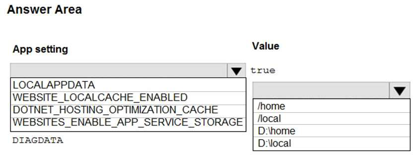
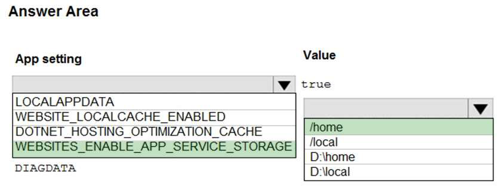
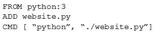
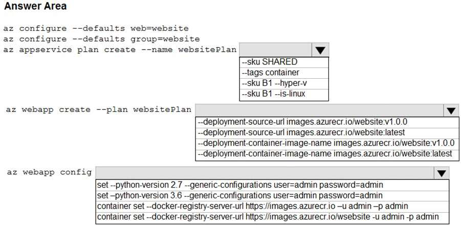
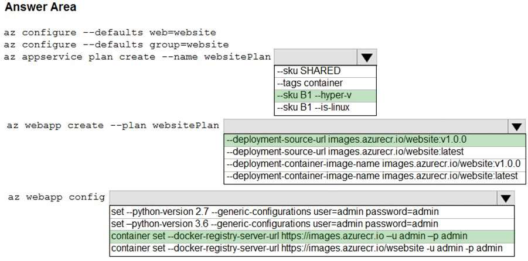
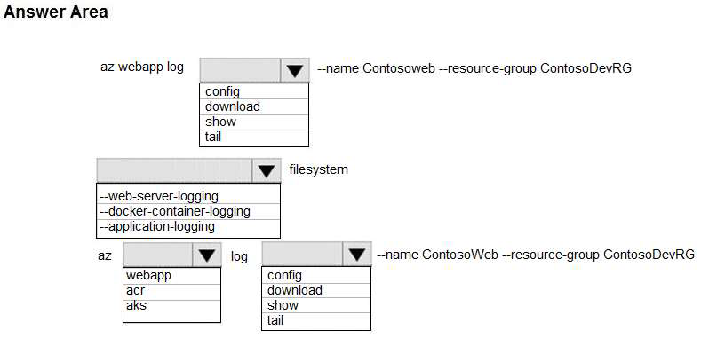
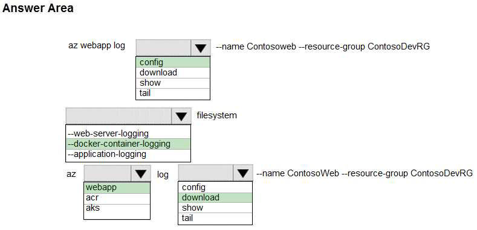

# Tema 4: Implement containerized solutions

### PREGUNTAS:

- ¿Cuál es la diferencia entre Azure Container Registry, Azure Container Instances y Azure
  Container Apps?
  
  Azure Container Registry (ACR), Azure Container Instances (ACI), y Azure Container Apps son servicios relacionados pero tienen diferentes funciones y casos de uso:
  
  1. Azure Container Registry (ACR): ACR es un servicio de registro de contenedores en Azure que permite almacenar, administrar y distribuir imágenes de contenedor. Es similar a un repositorio de imágenes de Docker y proporciona un lugar centralizado para almacenar y administrar las imágenes de tus contenedores. Puedes usar ACR para almacenar imágenes de contenedor privadas y acceder a ellas de forma segura en tu entorno de Azure. Es común utilizar ACR junto con Azure Kubernetes Service (AKS) para implementar y administrar aplicaciones basadas en contenedores en Azure.
  2. Azure Container Instances (ACI): ACI es un servicio de Azure que te permite ejecutar contenedores sin tener que aprovisionar ni administrar la infraestructura subyacente. Puedes ejecutar contenedores individuales o grupos de contenedores en ACI de forma rápida y sencilla. ACI es adecuado para cargas de trabajo puntuales, tareas de procesamiento en lotes, pruebas y desarrollo, y situaciones en las que no se requiere una orquestación completa de contenedores. ACI es una solución sin servidor y te permite pagar solo por el tiempo en que los contenedores están en ejecución.
  3. Azure Container Apps: Azure Container Apps es un servicio en versión previa que combina la simplicidad de Azure Container Instances con la administración y orquestación de contenedores a nivel de aplicación. Permite implementar, administrar y escalar aplicaciones basadas en contenedores de forma más sencilla. Con Azure Container Apps, puedes empaquetar una aplicación completa junto con sus dependencias y configuraciones en un solo contenedor y luego implementarlo y orquestarlo fácilmente en Azure. Azure Container Apps ofrece características adicionales, como la gestión de estado, la gestión de la conectividad de red y la integración con servicios relacionados de Azure.
  
  En resumen, Azure Container Registry se utiliza para almacenar y administrar imágenes de contenedor, Azure Container Instances se utiliza para ejecutar contenedores de forma rápida y sin servidor, y Azure Container Apps es una solución más completa para implementar y administrar aplicaciones basadas en contenedores en Azure.
  
  
  
- ¿Cómo se utiliza Azure Container Registry para almacenar y gestionar imágenes de
  contenedores?
  
  Para utilizar Azure Container Registry (ACR) para almacenar y gestionar imágenes de contenedores, sigue estos pasos:
  
  1. Crear un registro: En el portal de Azure, crea un nuevo Azure Container Registry. Proporciona un nombre único para el registro, selecciona la suscripción, el grupo de recursos y la ubicación.
  2. Autenticación y autorización: Configura la autenticación y autorización para el registro. Puedes elegir entre varias opciones, como el uso de Azure Active Directory (AD) para autenticación basada en roles o el acceso anónimo.
  3. Iniciar sesión en el registro: Una vez creado el registro, puedes iniciar sesión en él desde tu entorno local o desde una máquina virtual de Azure. Utiliza el comando `docker login` proporcionando la dirección del registro (nombre-registro.azurecr.io), tu nombre de usuario y tu contraseña.
  4. Construir y etiquetar imágenes: Construye tus imágenes de contenedor utilizando Docker o cualquier otra herramienta compatible. Etiqueta cada imagen con el nombre del registro (nombre-registro.azurecr.io) y la versión correspondiente.
  5. Subir imágenes al registro: Utiliza el comando `docker push` para subir las imágenes etiquetadas al registro de contenedores. Esto enviará las imágenes a Azure Container Registry.
  6. Administrar imágenes y etiquetas: En el portal de Azure o mediante la interfaz de línea de comandos, puedes administrar las imágenes y las etiquetas en tu registro. Puedes eliminar imágenes antiguas, agregar nuevas etiquetas a las imágenes existentes o configurar políticas de retención para controlar la vida útil de las imágenes.
  7. Descargar imágenes del registro: Si necesitas descargar imágenes del registro, puedes utilizar el comando `docker pull` proporcionando la dirección completa de la imagen (nombre-registro.azurecr.io/imagen:version).
  8. Integración con servicios de Azure: Puedes integrar Azure Container Registry con otros servicios de Azure, como Azure Kubernetes Service (AKS), para implementar y administrar aplicaciones basadas en contenedores de manera eficiente

- ¿Cuál es el propósito y la ventaja de utilizar Azure Container Instances para ejecutar contenedores sin necesidad de administrar una infraestructura subyacente?

El propósito principal de utilizar Azure Container Instances (ACI) es ejecutar contenedores sin la necesidad de administrar directamente la infraestructura subyacente. Algunas ventajas clave de utilizar ACI son:

1. Sin servidor y rápida implementación
2. Pago por uso
3. Escalabilidad automática
4. Granularidad y aislamiento
5. Integración con servicios de Azure
6. Compatibilidad con contenedores estándar

En resumen, la ventaja principal de utilizar Azure Container Instances es la simplicidad y la eliminación de la necesidad de administrar la infraestructura subyacente. ACI te permite ejecutar contenedores rápidamente, a escala y sin preocuparte por la administración de servidores, lo que simplifica y agiliza el despliegue de tus aplicaciones basadas en contenedores.

-------------------------------------------------------------------------------------------------------------------------------------------------------------------------------------------

### Identificar y explicar (comprobar si es posible) de la batería de Preguntas 3 preguntas por cada integrante relacionadas con Azure container registry y Azure Event Instance y Azure Container Apps

**DEVELOP AZURE COMPUTE SOLUTIONS - QUESTION SET 5 - PAGINA 21**

**QUESTION 1**

HOTSPOT
You are developing an ASP.NET Core web application. You plan to deploy the application to Azure Web
App for Containers.
The application needs to store runtime diagnostic data that must be persisted across application restarts.
You have the following code:

You need to configure the application settings so that diagnostic data is stored as required.
How should you configure the web app’s settings? To answer, select the appropriate options in the answer
area.

**SOLUCION:**

**EXPLICACION:**

Box 1: Si la configuración WEBSITES_ENABLE_APP_SERVICE_STORAGE no se especifica o se establece en true, el directorio /home/ se compartirá entre las instancias de escalado y los archivos escritos persistirán después de reinicios.

Box 2: /home

-------------------------------------------------------------------------------------------------------------------------------------------------------------------------------------------

**DEVELOP FOR AZURE STORAGE - QUESTION SET 4 - PAGINA 97**

**QUESTION 12**
**HOTSPOT**
You are preparing to deploy a Python website to an Azure Web App using a container. The solution will use
multiple containers in the same container group. The Dockerfile that builds the container is as follows:

You build a container by using the following command. The Azure Container Registry instance named
images is a private registry.

The user name and password for the registry is admin.
The Web App must always run the same version of the website regardless of future builds.
You need to create an Azure Web App to run the website.
How should you complete the commands? To answer, select the appropriate options in the answer area.

**SOLUCION:**

**EXPLICACION:**

Box 1: --SKU B1 --hyper-v

--hyper-v

Hospedar aplicación web en contenedor de Windows.

Box 2: --deployment-source-url images.azurecr.io/website:v1.0.0

--deployment-source-url -u

URL del repositorio Git para vincular con integración manual.

La aplicación web siempre debe ejecutar la misma versión del sitio web, independientemente de las compilaciones futuras.

Box 3: container set -url [https://images.azurecr.io](https://images.azurecr.io/) -u admin -p admin

az webapp config container set

Configurar los ajustes de un contenedor de una aplicación web.

Parámetro: --docker-registry-server-url -r

La URL del servidor del registro de contenedores.

La instancia del Registro de Contenedores de Azure llamada "images" es un registro privado.

-------------------------------------------------------------------------------------------------------------------------------------------------------------------------------------------

**MONITOR, TROUBLESHOOT, AND OPTIMIZE AZURE SOLUTIONS - QUESTION SET 5 - PAGINA 194**

**QUESTION 3**

HOTSPOT
You plan to deploy a web app to App Service on Linux. You create an App Service plan. You create and
push a custom Docker image that contains the web app to Azure Container Registry.
You need to access the console logs generated from inside the container in real-time.
How should you complete the Azure CLI command? To answer, select the appropriate options in the
answer area.

**SOLUCION:**

**EXPLICACION:**

Box 1: config

Para configurar el logging para una aplicación web, utiliza el siguiente comando: az webapp log config

Box 2: --docker-container-logging

La sintaxis incluye: az webapp log config [--docker-container-logging {filesystem, off}]

Box 3: webapp

Para descargar el historial de registros de una aplicación web como un archivo zip, utiliza el siguiente comando: az webapp log download

Box 4: download

