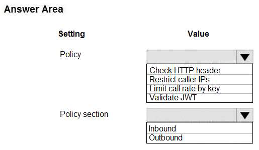
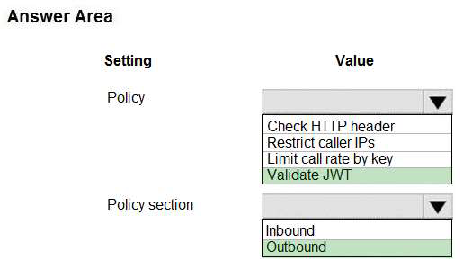

# Tema 5: Implement API Management

### Preguntas:

- ¿Qué es Azure API Management y cuál es su propósito en el desarrollo de aplicaciones?
- ¿Cuáles son los beneficios de utilizar Azure API Management para gestionar APIs en una
  arquitectura de microservicios?
- ¿Cómo se configura y se utiliza Azure API Management para controlar el acceso y la
  seguridad de las APIs?

-------------------------------------------------------------------------------------------------------------------------------------------------------------------------------------------

### Identificar y explicar (comprobar si es posible) de la batería de Preguntas 3 preguntas por cada integrante relacionadas con Azure API Management

**TESTLET 3 - CASE STUDY -  PAGINAS 129,130,131**

**QUESTION 3**

HOTSPOT
You need to configure API Management for authentication.
Which policy values should you use? To answer, select the appropriate options in the answer area.

**SOLUCION:**

**EXPLICACION:**

Box 1: Validate JWT

La política validate-jwt valida la existencia y validez de un JWT extraído de un encabezado HTTP especificado o un parámetro de consulta especificado. Esta política se utiliza en el contexto de la autenticación de usuarios y sigue los siguientes pasos:

1. El usuario selecciona "Iniciar sesión" en el sitio web.
2. El navegador redirige al usuario a la página de inicio de sesión de Azure Active Directory (Azure AD).
3. El usuario inicia sesión.
4. Azure AD redirige la sesión del usuario de vuelta a la aplicación web. La URL incluye un token de acceso.
5. La aplicación web llama a una API e incluye el token de acceso en el encabezado de autenticación. El ID de la aplicación se envía como la audiencia (reclamo 'aud') en el token de acceso.
6. La API de backend valida el token de acceso.

La política validate-jwt se encarga de verificar que el token de acceso sea válido y existe antes de que la aplicación pueda llamar a la API. Para ello, verifica la firma del token y otros detalles, como el reclamo de tiempo de expiración (exp). Dependiendo de la configuración, se puede requerir que el reclamo de tiempo de expiración esté presente en el token o no

Box 2: Outbound

-------------------------------------------------------------------------------------------------------------------------------------------------------------------------------------------

**TESTLET 3 - CASE STUDY - PAGINA 131**

**QUESTION 4**

You need to authenticate the user to the corporate website as indicated by the architectural diagram.
Which two values should you use? Each correct answer presents part of the solution.

A. ID token signature
B. ID token claims
C. HTTP response code
D. Azure AD endpoint URI
E. Azure AD tenant ID

**SOLUCION:**

- A. ID token signature
- D. Azure AD endpoint URI

**EXPLICACION:**

A: Los reclamos en los tokens de acceso Los JWT (JSON Web Tokens) se dividen en tres partes:

- Encabezado - Proporciona información sobre cómo validar el token, incluyendo detalles sobre el tipo de token y cómo se firmó.
- Carga útil - Contiene todos los datos importantes sobre el usuario o la aplicación que intenta llamar al servicio.
- Firma - Es el material utilizado para validar el token.

D: Su cliente puede obtener un token de acceso desde el punto de conexión v1.0 o el punto de conexión v2.0 utilizando una variedad de protocolos.

Escenario: Autenticación de usuario. Los siguientes pasos detallan el proceso de autenticación del usuario:

1. El usuario selecciona "Iniciar sesión" en el sitio web.
2. El navegador redirige al usuario a la página de inicio de sesión de Azure Active Directory (Azure AD).
3. El usuario inicia sesión.
4. Azure AD redirige la sesión del usuario de vuelta a la aplicación web. La URL incluye un token de acceso.
5. La aplicación web llama a una API e incluye el token de acceso en el encabezado de autenticación. El ID de la aplicación se envía como el reclamo de audiencia ('aud') en el token de acceso.
6. La API de backend valida el token de acceso.

Durante este proceso, los tokens de acceso contienen reclamos que proporcionan información importante, como la audiencia a la que está dirigido el token. Estos reclamos se utilizan para validar y autorizar las solicitudes realizadas por la aplicación web a la API de backend.

-------------------------------------------------------------------------------------------------------------------------------------------------------------------------------------------

**QUESTION SET 5 - PAGINA 148**

**QUESTION 8**

Your company is developing an Azure API.
You need to implement authentication for the Azure API. You have the following requirements:
All API calls must be secure.
Callers to the API must not send credentials to the API.
Which authentication mechanism should you use?
A. Basic
B. Anonymous
C. Managed identity
D. Client certificate

**SOLUCION:**

C. Managed Identity

**EXPLICACION:**

El uso de la política de autenticación con identidad administrada permite autenticarse con un servicio backend utilizando la identidad administrada del servicio de administración de API. Esta política utiliza la identidad administrada para obtener un token de acceso de Azure Active Directory que permite acceder al recurso especificado. Después de obtener exitosamente el token, la política establecerá el valor del token en el encabezado de autorización utilizando el esquema Bearer.

