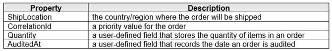
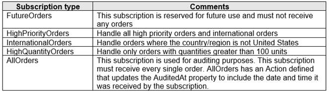
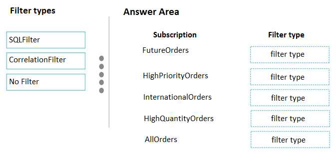
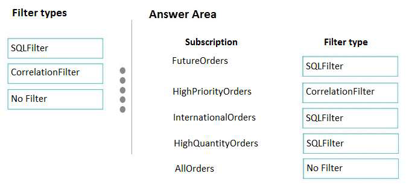
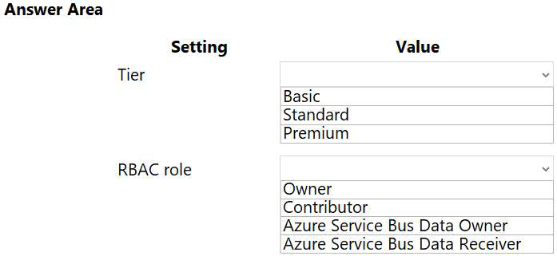
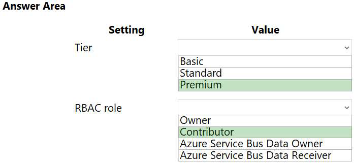

# Tema 6: Develop message-based solutions

### Preguntas:

- ¿Cuál es la diferencia entre Azure Message Queue, Azure Service Bus y Azure Queue
  Storage en términos de funcionalidad y casos de uso?
  
  La diferencia entre Azure Message Queue, Azure Service Bus y Azure Queue Storage en términos de funcionalidad y casos de uso es la siguiente:
  
  Azure Message Queue: Azure Message Queue no es un servicio independiente de Azure. Es probable que te refieras a Azure Queue Storage, que es un servicio de almacenamiento de colas en Azure. Azure Queue Storage es parte de la infraestructura de Azure Storage y permite almacenar grandes cantidades de mensajes. Puedes acceder a los mensajes a través de llamadas autenticadas utilizando HTTP o HTTPS desde cualquier parte del mundo. Los mensajes en una cola pueden tener un tamaño de hasta 64 KB, y una cola puede contener millones de mensajes, dentro del límite de capacidad total de una cuenta de almacenamiento. Las colas de almacenamiento se utilizan comúnmente para crear una cola de trabajo para procesar de forma asíncrona. Algunos casos de uso para Azure Queue Storage incluyen el procesamiento de tareas en segundo plano, la comunicación entre componentes de una aplicación y la integración de sistemas distribuidos.
  
  Azure Service Bus: Azure Service Bus es parte de una infraestructura de mensajería más amplia en Azure y admite colas, publicación/suscripción y patrones de integración más avanzados. Está diseñado para integrar aplicaciones o componentes de aplicaciones que pueden abarcar múltiples protocolos de comunicación, contratos de datos, dominios de confianza o entornos de red. Algunos casos de uso para Azure Service Bus incluyen la comunicación entre aplicaciones distribuidas, la orquestación de flujos de trabajo, la integración de sistemas empresariales y el enrutamiento de mensajes basado en reglas.
  
  En resumen, Azure Queue Storage es adecuado para escenarios de almacenamiento y procesamiento de mensajes en grandes cantidades, mientras que Azure Service Bus es más adecuado para escenarios de integración avanzados y comunicación entre sistemas distribuidos.
  
  
  
  
  
- ¿Cómo se utiliza Azure Message Queue para el envío y recepción de mensajes entre
  componentes de una aplicación distribuida?
  
  Azure Message Queue facilita la comunicación asíncrona y el acoplamiento débil entre los distintos componentes de una aplicación. Esto son los pasos para utilizar Azure Message Queue para enviar y recibir mensajes entre componentes:
  
  1. Crea una cuenta de almacenamiento de Azure
  2. Crea una aplicación: Para este ejemplo, crearemos una aplicación .NET Core que enviará y recibirá mensajes a través de la cola.
  3. Agrega las bibliotecas de cliente de Azure: Para interactuar con Azure Message Queue desde tu aplicación, necesitarás agregar las bibliotecas de cliente de Azure.
  4. Crea una cola: Utiliza las opciones proporcionadas por Azure, como el portal de Azure, PowerShell, CLI o plantillas de Azure Resource Manager, para crear una cola de mensajes en tu cuenta de almacenamiento.
  5. Envía mensajes a la cola: Utiliza las bibliotecas de cliente de Azure para enviar mensajes a la cola que has creado. Puedes generar y enviar mensajes en formato JSON, por ejemplo, utilizando la biblioteca `Microsoft.Azure.Storage.Queue` en .NET.
  6. Recibe mensajes de la cola: Utilizando las bibliotecas de cliente de Azure, puedes recibir mensajes de la cola y procesarlos en tus componentes de la aplicación distribuida. Puedes implementar un bucle de recepción de mensajes o utilizar eventos de desencadenamiento para manejar los mensajes recibidos.
  7. Procesa los mensajes: Una vez que hayas recibido un mensaje de la cola, puedes procesar su contenido en el componente correspondiente de tu aplicación distribuida. Realiza las operaciones necesarias y, si es necesario, envía respuestas o realiza acciones adicionales en función del mensaje recibido.

- ¿Cuál es el propósito y la ventaja de utilizar Azure Service Bus en comparación con otros
  servicios de mensajería?

  Propósito: Azure Service Bus está diseñado para desacoplar aplicaciones y servicios, lo que brinda las siguientes ventajas:

  1. Equilibrio de carga: Permite distribuir el trabajo entre trabajadores paralelos, lo que facilita la escalabilidad y la distribución de la carga de trabajo.
  2. Enrutamiento y transferencia de datos: Facilita el enrutamiento y la transferencia de datos de manera segura y controlada entre los límites de las aplicaciones y los servicios. Esto permite establecer una comunicación eficiente y confiable entre diferentes componentes de la aplicación.
  3. Coordinación de trabajo transaccional: Azure Service Bus es ideal para escenarios en los que se requiere un alto grado de confiabilidad y coordinación en el procesamiento de trabajos transaccionales. Proporciona una base sólida para el patrón de transacciones de compensación.

  

  Ventajas en comparación con otros servicios de mensajería: Al comparar Azure Service Bus con otros servicios de mensajería de Azure, como Azure Queue Storage, se pueden observar las siguientes ventajas:

  1. Características avanzadas: Azure Service Bus ofrece una infraestructura de mensajería más amplia que admite características avanzadas, como colas, temas y suscripciones. Está diseñado para integrar aplicaciones o componentes de aplicaciones que abarcan múltiples protocolos de comunicación, contratos de datos, dominios de confianza o entornos de red.
  2. Escalabilidad y capacidad: Azure Service Bus permite almacenar un gran número de mensajes y acceder a ellos desde cualquier parte del mundo mediante llamadas autenticadas. Además, ofrece una mayor capacidad de almacenamiento en comparación con Azure Queue Storage, lo que resulta beneficioso para aplicaciones que requieren el almacenamiento de grandes volúmenes de mensajes.
  3. Seguridad y confiabilidad: Azure Service Bus proporciona mecanismos de seguridad avanzados, como la autenticación y el cifrado, para garantizar la confidencialidad e integridad de los mensajes transmitidos. Además, ofrece características de entrega confiable, como la confirmación de recibos y el reenvío automático de mensajes en caso de errores.
  4. Flexibilidad en los patrones de mensajería: Azure Service Bus ofrece una variedad de patrones de mensajería, como colas, temas y suscripciones, que permiten establecer relaciones 1:n entre publicadores y suscriptores. Esto brinda flexibilidad en la comunicación y la capacidad de seleccionar mensajes específicos de una secuencia de mensajes publicados.

-----------------------------------------------------------------------------------------------------------------------------------------------------------

### Identificar y explicar (comprobar si es posible) de la batería de Preguntas 3 preguntas por cada integrante relacionadas con Azure Service Bus

**QUESTION SET 4  - PAGINA 86**

**QUESTION 5**

DRAG DROP
You are implementing an order processing system. A point of sale application publishes orders to topics in
an Azure Service Bus queue. The Label property for the topic includes the following data:

The system has the following requirements for subscriptions:

You need to implement filtering and maximize throughput while evaluating filters.
Which filter types should you implement? To answer, drag the appropriate filter types to the correct
subscriptions. Each filter type may be used once, more than once, or not at all. You may need to drag the
split bar between panes or scroll to view content.

Select and Place:

**SOLUCION:**

**EXPLICACION:**

FutureOrders: SQLFilter

HighPriortyOrders: CorrelationFilter

CorrelationID only

InternationalOrders: SQLFilter

Country NOT USA requires an SQL Filter

HighQuantityOrders: SQLFilter

Es necesario utilizar operadores relacionales, por lo que se necesita un filtro SQL.

AllOrders: No Filter

SQL Filter: Los filtros SQL son expresiones condicionales similares a SQL que se evalúan en el intermediario de mensajes. Se pueden utilizar operadores relacionales, lógicos y de coincidencia de patrones para realizar filtros basados en propiedades definidas por el usuario y propiedades del sistema de los mensajes entrantes. Los filtros SQL pueden probar la existencia de propiedades, valores nulos, realizar operaciones aritméticas numéricas simples y realizar coincidencia de patrones de texto simple con LIKE.

Correlation Filters: Los filtros de correlación contienen un conjunto de condiciones que se comparan con una o más propiedades del sistema y del usuario de un mensaje entrante. Un uso común es comparar con la propiedad CorrelationId, pero también se pueden utilizar otras propiedades como ContentType, Label, MessageId, ReplyTo, ReplyToSessionId, SessionId, To y cualquier propiedad definida por el usuario.

Filtros booleanos: TrueFilter y FalseFilter hacen que todos los mensajes entrantes (verdadero) o ninguno de los mensajes entrantes (falso) sean seleccionados para la suscripción

-----------------------------------------------------------------------------------------------------------------------------------------------------------

**QUESTION SET 4 - PAGINA 105**

**QUESTION 16**

You develop Azure solutions.
A .NET application needs to receive a message each time an Azure virtual machine finishes processing
data. The messages must NOT persist after being processed by the receiving application.
You need to implement the .NET object that will receive the messages.
Which object should you use?
A. QueueClient
B. SubscriptionClient
C. TopicClient
D. CloudQueueClient

**SOLUCION:**

D. CloudQueueClient

**EXPLICACION:**

Una cola permite el procesamiento de un mensaje por un único consumidor. Para acceder a la máquina virtual de Azure, se necesita un CloudQueueClient

-----------------------------------------------------------------------------------------------------------------------------------------------------------

**TESTLET 3 - CASE STUDY - PAGINA 133**

**QUESTION 6**

HOTSPOT
You need to configure Azure Service Bus to Event Grid integration.
Which Azure Service Bus settings should you use? To answer, select the appropriate options in the answer
area.

**SOLUCION:**

**EXPLICACION:**

Box 1: Premium

El servicio Bus ahora puede emitir eventos a Event Grid cuando hay mensajes en una cola o una suscripción y no hay receptores presentes. Puedes crear suscripciones de Event Grid para tus espacios de nombres de Servicio Bus, escuchar estos eventos y reaccionar a ellos iniciando un receptor. Con esta característica, puedes utilizar el Servicio Bus en modelos de programación reactiva. Para habilitar esta función, necesitas lo siguiente:

- Un espacio de nombres de Servicio Bus Premium con al menos una cola de Servicio Bus o un tema de Servicio Bus con al menos una suscripción.
- Acceso de contribuyente al espacio de nombres de Servicio Bus.

Box 2: Contributor