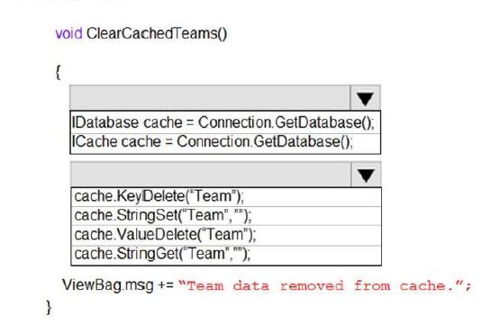

# Tema 7: Implement caching for solutions
## Preguntas:
- ¿Qué es la caché y cómo puede mejorar el rendimiento de una aplicación?

		La caché actúa como una capa de acceso a datos adyacente a la base de datos que las aplicaciones pueden utilizar para mejorar el rendimiento.
		Los tres tipos más comunes de cachés de bases de datos son los siguientes:
  	
  	  - Cachés integrados de bases de datos: algunas bases de datos, como Amazon Aurora, ofrecen un caché integrado que se administra dentro del motor de la base de datos y tiene capacidades integradas de escritura simultánea. Cuando los datos subyacentes cambian en la tabla de la base de datos, la base de datos actualiza su caché automáticamente, lo cual es excelente. No se requiere nada dentro del nivel de la aplicación para aprovechar esta memoria caché. Donde los cachés integrados se quedan cortos es en su tamaño y capacidades. Las memorias caché integradas normalmente se limitan a la memoria disponible asignada a la memoria caché por la instancia de la base de datos y no se pueden aprovechar para otros fines, como compartir datos con otras instancias.
  	
  	  - Cachés locales: un caché local almacena sus datos de uso frecuente dentro de su aplicación. Esto no solo acelera la recuperación de datos, sino que también elimina el tráfico de red asociado con la recuperación de datos, lo que hace que la recuperación de datos sea más rápida que otras arquitecturas de almacenamiento en caché. Una gran desventaja es que, entre sus aplicaciones, cada nodo tiene su propio caché residente que funciona de manera desconectada. La información almacenada dentro de un nodo de caché individual, ya sea su base de datos almacenada en caché, sesiones web o carritos de compras de usuarios, no se puede compartir con otros cachés locales. Esto crea desafíos en un entorno distribuido donde el intercambio de información es fundamental para admitir entornos dinámicos escalables. Y dado que la mayoría de las aplicaciones utilizan varios servidores de aplicaciones, si cada servidor tiene su propio caché, la coordinación de los valores entre estos se convierte en un gran desafío.
  	  
  	  - Cachés remotos: los cachés remotos se almacenan en servidores dedicados y, por lo general, se basan en almacenes NoSQL de clave/valor, como Redis y Memcached. Proporcionan cientos de miles hasta un millón de solicitudes por segundo por nodo de caché. Muchas soluciones, como Amazon ElastiCache para Redis, también brindan la alta disponibilidad necesaria para las cargas de trabajo críticas.
  	  - 
- ¿Cuáles son las opciones de caché disponibles en Azure?
        Azure permite 3 tipos:
        - Almacenamiento en caché en aplicaciones distribuidas:
            Las aplicaciones distribuidas normalmente implementan ambas de las siguientes estrategias, o una de ellas, al almacenar datos en caché:

            Usan una caché privado, donde los datos se guardan localmente en el equipo que ejecuta una instancia de una aplicación o servicio.
            Usan una caché compartida, que actúa como un origen común al que se puede acceder desde varios procesos y máquinas.
            En ambos casos, el almacenamiento en caché se puede realizar en el lado cliente y servidor. El almacenamiento en caché en el lado cliente se realiza mediante el proceso que proporciona la interfaz de usuario de un sistema, como un explorador web o una aplicación de escritorio. El almacenamiento en caché en el lado servidor se realiza mediante el proceso que proporciona los servicios de negocios que se ejecutan de forma remota.
        
        - Almacenamiento en caché privado:
            El tipo más básico de caché es un almacén en memoria. Está contenido en el espacio de direcciones de un solo proceso y se accede directamente a él mediante el código que se ejecuta en ese proceso. Este tipo de memoria caché es de acceso rápido. También puede proporcionar un medio eficaz para almacenar cantidades moderadas de datos estáticos. El tamaño de una memoria caché suele estar restringido por la cantidad de memoria disponible en el equipo que hospeda el proceso.
        
        - Almacenamiento en caché compartido:
            El uso de una caché compartida puede ayudar a aliviar la preocupación de que los datos pueden ser diferentes en cada caché, como puede ocurrir con el almacenamiento en caché en memoria. El almacenamiento en caché compartido garantiza que diferentes instancias de una aplicación ven la misma vista de datos en caché. Ubica la caché en una ubicación independiente, que suele hospedarse como parte de un servicio independiente
    
- ¿Cómo se implementa y se utiliza la caché en una solución en Azure?

        - Para crear una instancia de caché, inicie sesión en Azure Portal y seleccione Crear un recurso.
        
        - En la página Nuevo, seleccione Base de datos y, a continuación, seleccione Azure Cache for Redis.
        
        - En la página Nueva instancia de Redis Cache, configure las opciones de la nueva caché.
        
        - Seleccione la pestaña Redes o elija el botón Redes situado en la parte inferior de la página.
        
        - En la pestaña Redes, seleccione el método de conectividad.
        
        - Seleccione la pestaña Siguiente: Opciones avanzadas o seleccione el botón Siguiente: Opciones avanzadas en la parte inferior de la página.
        
        - En la pestaña Opciones avanzadas de una instancia de caché básica o estándar, seleccione el botón de alternancia de habilitación si desea habilitar un puerto que no sea TLS. También puede seleccionar la versión de Redis que quiere usar, 4 o 6.
        
        - En la pestaña Opciones avanzadas de la instancia de caché Premium, configure el puerto no TLS, la agrupación en clústeres y la persistencia de datos. También puede seleccionar la versión de Redis que quiere usar, 4 o 6.
        
        - Seleccione el botón Siguiente: Opciones avanzadas o elija el botón Siguiente: Etiquetas situado en la parte inferior de la página.
        
        - Opcionalmente, en la pestaña Etiquetas, escriba el nombre y el valor si desea clasificar el recurso.
        
        - Seleccione Revisar + crear. Pasará a la pestaña Revisar y crear, donde Azure validará la configuración.
        
        - Tras aparecer el mensaje verde Validación superada, seleccione Crear
        
        La caché tarda un tiempo en crearse. Puede supervisar el progreso en la página Información general de Azure Cache for Redis. Cuando Estado se muestra como En ejecución, la memoria caché está lista para su uso.

## Preguntas de la Bateria:

### QUESTION 1 - Pagina 191
Note: This question is part of a series of questions that present the same scenario. Each question
in the series contains a unique solution. Determine whether the solution meets the stated goals.
You are developing and deploying several ASP.NET web applications to Azure App Service. You plan to
save session state information and HTML output.
You must use a storage mechanism with the following requirements:
Share session state across all ASP.NET web applications.
Support controlled, concurrent access to the same session state data for multiple readers and a single
writer.
Save full HTTP responses for concurrent requests.
You need to store the information.
Proposed Solution: Deploy and configure Azure Cache for Redis. Update the web applications.
Does the solution meet the goal?
A. Yes
B. No

        La respuesta seria Si, ya que al proveedor de estado de sesión para Azure Cache for Redis le permite compartir información de sesión entre
        diferentes instancias de una aplicación web ASP.NET.
        La misma conexión puede ser utilizada por varios subprocesos simultáneos.
        Redis admite operaciones de lectura y escritura y le permite guardar las respuestas HTTP generadas por una aplicación web ASP.NET.

## QUESTION 11 - Pagina 203
Note: This question is part of a series of questions that present the same scenario. Each question
in the series contains a unique solution. Determine whether the solution meets the stated goals.
You are developing and deploying several ASP.NET web applications to Azure App Service. You plan to
save session state information and HTML output.
You must use a storage mechanism with the following requirements:
Share session state across all ASP.NET web applications.
Support controlled, concurrent access to the same session state data for multiple readers and a single
writer.
Save full HTTP responses for concurrent requests.
You need to store the information.
Proposed Solution: Deploy and configure an Azure Database for PostgreSQL. Update the web
applications.
Does the solution meet the goal?
A. Yes
B. No

        La respuesta seria No, ya que es mas eficiente utilizar y configurar el Azure Cache for Redis y actualizar las aplicaciones web como se ha explicado en la pregunta anterior

### QUESTION 12 - Pagina 203
HOTSPOT
A company is developing a gaming platform. Users can join teams to play online and see leaderboards that
include player statistics. The solution includes an entity named Team.
You plan to implement an Azure Redis Cache instance to improve the efficiency of data operations for
entities that rarely change.
You need to invalidate the cache when team data is changed.
How should you complete the code? To answer, select the appropriate options in the answer area.

        Box 1: IDatabase cache = connection.GetDatabase();
            Conexión se refiere a un ConnectionMultiplexer previamente configurado.
        Box 2: cache.StringSet("teams",")
            Para especificar la caducidad de un elemento en la memoria caché, utilice el parámetro TimeSpan de StringSet. 
            cache.StringSet("key1", "value1", TimeSpan.FromMinutes(90));
